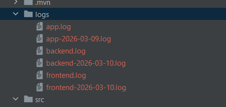

**Triển khai setup logging**

Config logback:
```
<configuration>
    <appender name="CONSOLE" class="ch.qos.logback.core.ConsoleAppender">
        <encoder>
            <pattern>%d{yyyy-MM-dd HH:mm:ss} [%thread] %-5level %logger{36} | %msg%n</pattern>
        </encoder>
    </appender>
    <appender name="BACKEND_FILE" class="ch.qos.logback.core.rolling.RollingFileAppender">
        <file>logs/backend.log</file>

        <encoder>
            <pattern>%d{yyyy-MM-dd HH:mm:ss} [%thread] %-5level %logger{36} | %msg%n</pattern>
        </encoder>

        <rollingPolicy class="ch.qos.logback.core.rolling.TimeBasedRollingPolicy">
            <fileNamePattern>logs/backend-%d{yyyy-MM-dd}.log</fileNamePattern>
            <maxHistory>30</maxHistory>
        </rollingPolicy>
    </appender>
    <appender name="FRONTEND_FILE" class="ch.qos.logback.core.rolling.RollingFileAppender">
        <file>logs/frontend.log</file>

        <encoder>
            <pattern>%d{yyyy-MM-dd HH:mm:ss} [FRONTEND] %-5level %logger{36} | %msg%n</pattern>
        </encoder>

        <rollingPolicy class="ch.qos.logback.core.rolling.TimeBasedRollingPolicy">
            <fileNamePattern>logs/frontend-%d{yyyy-MM-dd}.log</fileNamePattern>
            <maxHistory>30</maxHistory>
        </rollingPolicy>
    </appender>
    <logger name="frontendLogger" level="INFO" additivity="false">
        <appender-ref ref="FRONTEND_FILE"/>
    </logger>
    <root level="INFO">
        <appender-ref ref="CONSOLE"/>
        <appender-ref ref="BACKEND_FILE"/>
    </root>
</configuration>
```

Setup để log chạy ra ở cả console lẫn ghi vào file, log của backend và frontend sẽ được chia thành 2 file khác nhau. Log sẽ được ghi vào file backend.log và frontend.log, khi ngày mới bắt đầu thì hệ thống sẽ tự tạo file log mới và rename 2 file log cũ để đánh dấu ngày log.



FE: https://github.com/RealTranaf/logging-fe

BE: https://github.com/RealTranaf/logging-be

**OpenClaw phân tích file log**

Đưa cho bot file log:

```
✅ Backend (Spring Boot) log highlights

Startup + shutdown sequence

• App shuts down gracefully at 11:17:56, then restarts at 11:18:01.
• Tomcat started on port 8080.
• Database connection via HikariPool established successfully.
• No fatal errors during startup.

Repository warning

copy


Spring Data JDBC - Could not safely identify store assignment for repository candidate interface GameRepository


• This warning means Spring isn’t sure if the repo is JDBC or JPA.
• It 
did find 1 JPA repository and started fine.
• Fix: annotate entity with @Table (if JDBC), or ensure repository extends the right JPA interface.

API activity

• Calls are clean: /logs, /games, /games/{id} with 200 responses.
• Full CRUD observed:
  • GET /games returns 8 → later 7 after delete
  • PUT /games/1 update success
  • DELETE /games/14 success
  • POST /games add success

Shutdown

• Graceful shutdown at 11:21:32 (normal).

───

✅ Frontend log highlights

• App is running at http://localhost:3000/
• Fetching game list works (8 games → 7 after delete → 8 after add)
• UI actions logged cleanly:
  • Open edit modal
  • Update game
  • Delete game
  • Add new game
• No frontend errors present

───

⚠️ Observations / potential improvements

1. Duplicate requests
  • Multiple GET /games at same timestamp.
  • Could be React double‑render (StrictMode) or multiple UI triggers.
  • Not necessarily a bug, but worth checking.
2. Repository configuration warning
  • Not fatal, but worth cleaning up:
    • Use @Entity + JpaRepository
    • Or @Table + JdbcRepository, not both.

───

✅ Verdict

Everything appears healthy and functional.
No crashes, no 5xx responses, and CRUD flow looks normal.

If you want, I can also:

• build a timeline of actions across frontend/backend
• identify duplicate request causes
• recommend repository config fixes in Spring.
```

OpenClaw có thể phân tích kĩ log của ứng dụng, nhận định những vấn đề đang hiện hữu và gợi ý cách sửa. Có thể đưa file log cho bot qua chat hoặc chạy ứng dụng trong môi trường của OpenClaw và bảo nó phân tích.